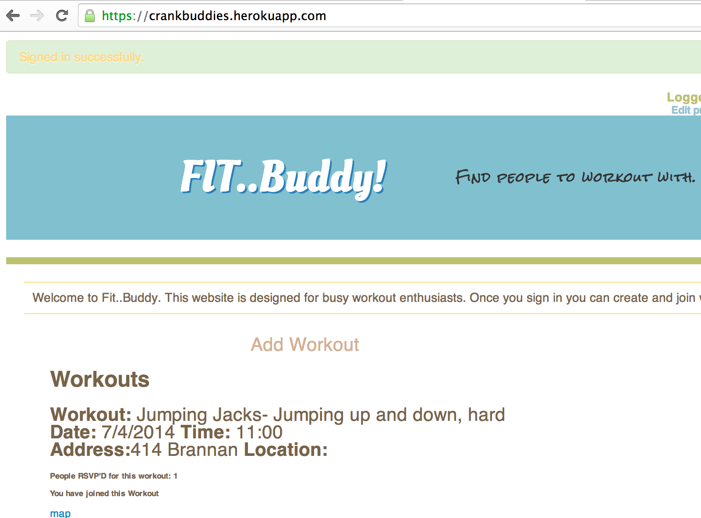
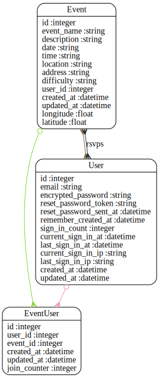

Code Review for shanna
================================================
Project: crankbuddy
================================================
#URLS

* HEROKU: https://crankbuddies.herokuapp.com/
* GITHUB: https://github.com/Githubshanna/crankbuddy

# Summary


A cool site to share workout details so you can meet up with other exercise buddies:
This website is designed for busy workout enthusiasts. 
Once you sign in you can create and join workouts with other people on your own schedule.





#Review Rubric

##Implemtation Expecations

###Process
* Documentation
  * Expectation: Github Repo includes a link to the live site. README defines the software's purpose, technology used, ERD and user stories.
  * Evaluation: Short readme, missing link to live site 
 * Deployment
  * Expectation: Project on Heroku
  * Evaluation: Deployed!
* Branching Strategy
  * Expectation: Branching is used for all new features.  No changes are made directly in the master branch
  * Evaluation: Some branching used
* Commit Messages
  * Expectation: Commit message describes the changes made in detail.  A commit focus on one thing only.
  * Evaluation: Short but meaningful comments

Investigate feature based branching

###Code Quality
* Well-formatted, clean project
  * Expectation: Code generally follows whitespace conventions, but still includes some "messy" areas that should be cleaned up.
  * Evaluation: Unused / comment out code should be removed
* DRY
  * Expectation: Helper methods are utilized, and effort is made to refactor code.
  * Evaluation: Helpers are blank
* Expresses Intent / Naming
  * Expectation: Names follow language conventions and are generally succinct about what they refer to, or what their purpose is. Cryptic shorthand phrases are avoided.
  * Evaluation: Normal naming conventions are followed
* Small
  * Expectation: Successfully utilizes helper methods to keep controllers slim.
  * Evaluation: The app is small, not overly complex
* Tested
  * Expectation: Unit and acceptance tests written for all software components, but may not adequately validate component behaviors.
  * Evaluation: Test suite does not run for me

Ensure test suite is running

###Implementation Requirements
* Validation
  * Expectation: Models fully validated both on the SQL and ActiveRecord level
  * Evaluation: Nice event validations
* Authentication
  * Expectation: Functional authentication system
  * Evaluation: Devise used (devise :database_authenticatable, :registerable, :recoverable, :rememberable, :trackable, :validatable)
* Authorization
  * Expectation: Authorization is functional, but the user experience is poor.  For example, a 500 error happens when trying to access an unauthorized resource
  * Evaluation: Some missing checks, Event update and destroy are not protected
* New Technology
  * Expectation: Utilitzes a new JSON API or gem that adds new functionality
  * Evaluation: Use of Geocoder
* Javascript, jQuery
  * Expectation: Adds javascript to the applicaiton to enhance functionality 
  * Evaluation: I don't see jQuery usage (empty coffeescript files)
* AJAX
  * Expectation: Uses AJAX where appropriate
  * Evaluation: (not used)
* Sidekiq
  * Expectation: Sidekiq or some other asynchronous technology is used to do longer running tasks separately from the response to a HTTP request
  * Evaluation: (not used)
  
  
Improve authorization, add some javascript functionality and possibly send out alerts from a siqkiq worker  

###Overall
The application doesn't have an abundance of functionality, I would have liked to have seen more features, maybe emails or some kind of alerts
  

#Your Gemfile

```
source 'https://rubygems.org'


# Bundle edge Rails instead: gem 'rails', github: 'rails/rails'
gem 'rails', '4.1.1'
# Use postgresql as the database for Active Record

#post gress gem
gem 'pg'

#this does our pagination
gem 'kaminari'
# does the mapping function with google maps/static map uses lat long via address
gem 'geocoder'
# gem 'bootstrap-sass'
# gem 'bootstrap-generators'
gem "therubyracer"

#sets up boostrap path gives it a higher priority for load
gem "less-rails" 
#loads bootstrap
gem "twitter-bootstrap-rails"
#creates login functionality
gem 'devise'
# Use SCSS for stylesheets
#stylesheets
gem 'sass-rails', '~> 4.0.3'
# Use Uglifier as compressor for JavaScript assets
gem 'uglifier', '>= 1.3.0'
# Use CoffeeScript for .js.coffee assets and views
gem 'coffee-rails', '~> 4.0.0'
# See https://github.com/sstephenson/execjs#readme for more supported runtimes
# gem 'therubyracer',  platforms: :ruby

# Use jquery as the JavaScript library
gem 'jquery-rails'
# Turbolinks makes following links in your web application faster. Read more: https://github.com/rails/turbolinks
gem 'turbolinks'
# Build JSON APIs with ease. Read more: https://github.com/rails/jbuilder
gem 'jbuilder', '~> 2.0'
# bundle exec rake doc:rails generates the API under doc/api.
gem 'sdoc', '~> 0.4.0',          group: :doc

# Spring speeds up development by keeping your application running in the background. Read more: https://github.com/rails/spring
gem 'spring',        group: :development
#enables serving assets in production and setting your logger to standard out
gem 'rails_12factor', group: :production

group :development do 
  #does the Env file and funciton allows you to run your app in different enviornments
  gem 'dotenv-rails'
  #turns off the Rails asset pipeline log. This means that it suppresses messages in your development log
  gem 'quiet_assets'
  #shows the color shemes in ruby 
  gem 'awesome_print'
  # allows you to interupt execution and access database for debugging
  gem 'pry-rails'
  gem 'pry-byebug'
  gem "better_errors"
  
end


group :development, :test do
  #rspec replaces the test unit that is default in rails
  gem 'rspec-rails', '2.99'
  #helps simplify and set up more concise tests
  gem 'shoulda-matchers'
  #Making meaningful development data for your application. more useful seed data
  gem 'forgery'
end

gem "binding_of_caller"

# Use ActiveModel has_secure_password
# gem 'bcrypt', '~> 3.1.7'

# Use unicorn as the app server
# gem 'unicorn'

# Use Capistrano for deployment
# gem 'capistrano-rails', group: :development

# Use debugger
# gem 'debugger', group: [:development, :test]


```


#Your Schema

```
# encoding: UTF-8
# This file is auto-generated from the current state of the database. Instead
# of editing this file, please use the migrations feature of Active Record to
# incrementally modify your database, and then regenerate this schema definition.
#
# Note that this schema.rb definition is the authoritative source for your
# database schema. If you need to create the application database on another
# system, you should be using db:schema:load, not running all the migrations
# from scratch. The latter is a flawed and unsustainable approach (the more migrations
# you'll amass, the slower it'll run and the greater likelihood for issues).
#
# It's strongly recommended that you check this file into your version control system.

ActiveRecord::Schema.define(version: 20140625194723) do

  # These are extensions that must be enabled in order to support this database
  enable_extension "plpgsql"

  create_table "event_users", force: true do |t|
    t.integer  "user_id"
    t.integer  "event_id"
    t.datetime "created_at"
    t.datetime "updated_at"
    t.integer  "join_counter"
  end

  add_index "event_users", ["event_id"], name: "index_event_users_on_event_id", using: :btree
  add_index "event_users", ["user_id"], name: "index_event_users_on_user_id", using: :btree

  create_table "events", force: true do |t|
    t.string   "event_name"
    t.string   "description"
    t.string   "date"
    t.string   "time"
    t.string   "location"
    t.string   "address"
    t.string   "difficulty"
    t.integer  "user_id"
    t.datetime "created_at"
    t.datetime "updated_at"
    t.float    "longitude"
    t.float    "latitude"
  end

  add_index "events", ["user_id"], name: "index_events_on_user_id", using: :btree

  create_table "users", force: true do |t|
    t.string   "email",                  default: "", null: false
    t.string   "encrypted_password",     default: "", null: false
    t.string   "reset_password_token"
    t.datetime "reset_password_sent_at"
    t.datetime "remember_created_at"
    t.integer  "sign_in_count",          default: 0,  null: false
    t.datetime "current_sign_in_at"
    t.datetime "last_sign_in_at"
    t.string   "current_sign_in_ip"
    t.string   "last_sign_in_ip"
    t.datetime "created_at"
    t.datetime "updated_at"
  end

  add_index "users", ["email"], name: "index_users_on_email", unique: true, using: :btree
  add_index "users", ["reset_password_token"], name: "index_users_on_reset_password_token", unique: true, using: :btree

end

```


#Your Schema Diagram





#Your Rspec Results

```

```


#Automated Best Practices Review Results

```


Source Codes: |===============================================================================================================================================|
/work/ga/wdi/2014/march/final_project/shanna/app/helpers/event_users_helper.rb:1 - remove empty helpers
/work/ga/wdi/2014/march/final_project/shanna/app/helpers/events_helper.rb:1 - remove empty helpers
/work/ga/wdi/2014/march/final_project/shanna/config/routes.rb:6 - restrict auto-generated routes event_users (only: [:create])
/work/ga/wdi/2014/march/final_project/shanna/app/views/events/create.html.erb:35 - simplify render in views
/work/ga/wdi/2014/march/final_project/shanna/app/views/events/index.html.erb:35 - simplify render in views
/work/ga/wdi/2014/march/final_project/shanna/app/views/events/my_events.html.erb:21 - simplify render in views
/work/ga/wdi/2014/march/final_project/shanna/Gemfile:20 - remove trailing whitespace
/work/ga/wdi/2014/march/final_project/shanna/app/models/event.rb:23 - remove trailing whitespace
/work/ga/wdi/2014/march/final_project/shanna/app/models/user.rb:8 - remove trailing whitespace
/work/ga/wdi/2014/march/final_project/shanna/app/controllers/events_controller.rb:6 - remove trailing whitespace
/work/ga/wdi/2014/march/final_project/shanna/config/environment.rb:7 - remove trailing whitespace
/work/ga/wdi/2014/march/final_project/shanna/config/routes.rb:9 - remove trailing whitespace
/work/ga/wdi/2014/march/final_project/shanna/app/views/events/_event.html.erb:6 - remove trailing whitespace
/work/ga/wdi/2014/march/final_project/shanna/app/views/events/create.html.erb:4 - remove trailing whitespace
/work/ga/wdi/2014/march/final_project/shanna/app/views/events/edit.html.erb:2 - remove trailing whitespace
/work/ga/wdi/2014/march/final_project/shanna/app/views/events/index.html.erb:41 - remove trailing whitespace
/work/ga/wdi/2014/march/final_project/shanna/app/views/events/my_events.html.erb:9 - remove trailing whitespace
/work/ga/wdi/2014/march/final_project/shanna/app/views/events/new.html.erb:19 - remove trailing whitespace
/work/ga/wdi/2014/march/final_project/shanna/app/views/events/show.html.erb:13 - remove trailing whitespace

Please go to http://rails-bestpractices.com to see more useful Rails Best Practices.

Found 19 warnings.

```


#Automated Code Review Results

```
Inspecting 25 files
WCC...CCC.CW..CC.CCCCCCCC

Offenses:

app/controllers/application_controller.rb:6:3: C: Use alias_method instead of alias.
  alias :std_redirect_to :redirect_to
  ^^^^^
app/controllers/application_controller.rb:7:1: C: Inconsistent indentation detected.
def redirect_to(*args)
^^^^^^^^^^^^^^^^^^^^^^
app/controllers/application_controller.rb:9:19: W: Ambiguous splat operator. Parenthesize the method arguments if it's surely a splat operator, or add a whitespace to the right of the * if it should be a multiplication.
  std_redirect_to *args
                  ^
app/controllers/event_users_controller.rb:2:1: C: Extra empty line detected at body beginning.
app/controllers/event_users_controller.rb:3:3: C: Missing space after #.
  #this method creates the relationship on the event_user table that is used for the join button, once the person has joined an event they are redirected to their mt_event page
  ^^^^^^^^^^^^^^^^^^^^^^^^^^^^^^^^^^^^^^^^^^^^^^^^^^^^^^^^^^^^^^^^^^^^^^^^^^^^^^^^^^^^^^^^^^^^^^^^^^^^^^^^^^^^^^^^^^^^^^^^^^^^^^^^^^^^^^^^^^^^^^^^^^^^^^^^^^^^^^^^^^^^^^^^^^^^^^
app/controllers/event_users_controller.rb:3:121: C: Line is too long. [176/120]
  #this method creates the relationship on the event_user table that is used for the join button, once the person has joined an event they are redirected to their mt_event page
                                                                                                                        ^^^^^^^^^^^^^^^^^^^^^^^^^^^^^^^^^^^^^^^^^^^^^^^^^^^^^^^^
app/controllers/event_users_controller.rb:7:1: C: Extra empty line detected at body end.
app/controllers/events_controller.rb:2:1: C: Extra empty line detected at body beginning.
app/controllers/events_controller.rb:3:3: C: Incorrect indentation detected (column 2 instead of 1).
  # autheniticates user as loggedin for specific method usage
  ^^^^^^^^^^^^^^^^^^^^^^^^^^^^^^^^^^^^^^^^^^^^^^^^^^^^^^^^^^^
app/controllers/events_controller.rb:4:1: C: Use 2 (not 1) spaces for indentation.
 before_action :authenticate_user!, only: [:edit, :update, :destroy, :new, :create, :my_events]
^
app/controllers/events_controller.rb:6:1: C: Incorrect indentation detected (column 0 instead of 2).
# method to list all events 
^^^^^^^^^^^^^^^^^^^^^^^^^^^^
app/controllers/events_controller.rb:6:28: C: Trailing whitespace detected.
# method to list all events 
                           ^
app/controllers/events_controller.rb:7:3: C: Inconsistent indentation detected.
  def index
  ^^^^^^^^^
app/controllers/events_controller.rb:8:5: C: Missing space after #.
    #creates instance variable for event index in descending order and pagination
    ^^^^^^^^^^^^^^^^^^^^^^^^^^^^^^^^^^^^^^^^^^^^^^^^^^^^^^^^^^^^^^^^^^^^^^^^^^^^^
app/controllers/events_controller.rb:13:1: C: Extra empty line detected at body end.
app/controllers/events_controller.rb:16:3: C: Missing space after #.
  #allows you to display a newly created event as well as all the 
  ^^^^^^^^^^^^^^^^^^^^^^^^^^^^^^^^^^^^^^^^^^^^^^^^^^^^^^^^^^^^^^^^
app/controllers/events_controller.rb:16:66: C: Trailing whitespace detected.
  #allows you to display a newly created event as well as all the 
                                                                 ^
app/controllers/events_controller.rb:17:3: C: Missing space after #.
  #events you are a part of using the user_id
  ^^^^^^^^^^^^^^^^^^^^^^^^^^^^^^^^^^^^^^^^^^^
app/controllers/events_controller.rb:18:3: C: Inconsistent indentation detected.
  def show
  ^^^^^^^^
app/controllers/events_controller.rb:23:3: C: Inconsistent indentation detected.
  def new
  ^^^^^^^
app/controllers/events_controller.rb:27:1: C: Extra blank line detected.
app/controllers/events_controller.rb:28:3: C: Missing space after #.
  #creates a new event for a user with certain params, and attaches the event and user via event_user table
  ^^^^^^^^^^^^^^^^^^^^^^^^^^^^^^^^^^^^^^^^^^^^^^^^^^^^^^^^^^^^^^^^^^^^^^^^^^^^^^^^^^^^^^^^^^^^^^^^^^^^^^^^^
app/controllers/events_controller.rb:29:3: C: Inconsistent indentation detected.
  def create
  ^^^^^^^^^^
app/controllers/events_controller.rb:32:1: C: Trailing whitespace detected.
app/controllers/events_controller.rb:33:5: C: Missing space after #.
    #if the event saves it shows the notification and redirects you to index page
    ^^^^^^^^^^^^^^^^^^^^^^^^^^^^^^^^^^^^^^^^^^^^^^^^^^^^^^^^^^^^^^^^^^^^^^^^^^^^^
app/controllers/events_controller.rb:35:24: C: Prefer single-quoted strings when you don't need string interpolation or special symbols.
      flash[:notice] = "Your Event was created"
                       ^^^^^^^^^^^^^^^^^^^^^^^^
app/controllers/events_controller.rb:40:24: C: Prefer single-quoted strings when you don't need string interpolation or special symbols.
      flash[:notice] = "Your Event was not created, please retry!"
                       ^^^^^^^^^^^^^^^^^^^^^^^^^^^^^^^^^^^^^^^^^^^
app/controllers/events_controller.rb:45:3: C: Missing space after #.
  #shows a page of only the current users events
  ^^^^^^^^^^^^^^^^^^^^^^^^^^^^^^^^^^^^^^^^^^^^^^
app/controllers/events_controller.rb:46:3: C: Inconsistent indentation detected.
  def my_events
  ^^^^^^^^^^^^^
app/controllers/events_controller.rb:50:3: C: Missing space after #.
  #allows the current user to edit their events
  ^^^^^^^^^^^^^^^^^^^^^^^^^^^^^^^^^^^^^^^^^^^^^
app/controllers/events_controller.rb:51:3: C: Inconsistent indentation detected.
  def edit
  ^^^^^^^^
app/controllers/events_controller.rb:59:3: C: Missing space after #.
  #updates the event after it has been edited and redirects back tot he index page
  ^^^^^^^^^^^^^^^^^^^^^^^^^^^^^^^^^^^^^^^^^^^^^^^^^^^^^^^^^^^^^^^^^^^^^^^^^^^^^^^^
app/controllers/events_controller.rb:60:3: C: Inconsistent indentation detected.
  def update
  ^^^^^^^^^^
app/controllers/events_controller.rb:66:3: C: Missing space after #.
  #deletes items
  ^^^^^^^^^^^^^^
app/controllers/events_controller.rb:67:3: C: Inconsistent indentation detected.
  def destroy
  ^^^^^^^^^^^
app/controllers/events_controller.rb:68:3: C: Use 2 (not 3) spaces for indentation.
     @event = Event.find_by_id(params[:id])
  ^^^
app/controllers/events_controller.rb:69:7: C: Inconsistent indentation detected.
      @event.destroy
      ^^^^^^^^^^^^^^
app/controllers/events_controller.rb:70:7: C: Inconsistent indentation detected.
      redirect_to request.referer
      ^^^^^^^^^^^^^^^^^^^^^^^^^^^
app/controllers/events_controller.rb:73:3: C: Missing space after #.
  #sets up the parameters taht are required to create an event as well as those permited to be filled 
  ^^^^^^^^^^^^^^^^^^^^^^^^^^^^^^^^^^^^^^^^^^^^^^^^^^^^^^^^^^^^^^^^^^^^^^^^^^^^^^^^^^^^^^^^^^^^^^^^^^^^
app/controllers/events_controller.rb:73:102: C: Trailing whitespace detected.
  #sets up the parameters taht are required to create an event as well as those permited to be filled 
                                                                                                     ^
app/controllers/events_controller.rb:74:3: C: Keep a blank line before and after private.
  private
  ^^^^^^^
app/controllers/events_controller.rb:75:3: C: Inconsistent indentation detected.
  def event_params
  ^^^^^^^^^^^^^^^^
app/controllers/events_controller.rb:76:3: C: Use 2 (not 4) spaces for indentation.
      params.require(:event).permit(:event_name, :description, :date, :time, :address, :location, :difficulty)
  ^^^^
app/models/event.rb:2:4: C: Incorrect indentation detected (column 3 instead of 2).
   #this event is created by/belongs to a single user
   ^^^^^^^^^^^^^^^^^^^^^^^^^^^^^^^^^^^^^^^^^^^^^^^^^^
app/models/event.rb:2:4: C: Missing space after #.
   #this event is created by/belongs to a single user
   ^^^^^^^^^^^^^^^^^^^^^^^^^^^^^^^^^^^^^^^^^^^^^^^^^^
app/models/event.rb:5:3: C: Incorrect indentation detected (column 2 instead of 3).
  #these are the validations that create safety and force people to fill out the create event form properly to my spcifications
  ^^^^^^^^^^^^^^^^^^^^^^^^^^^^^^^^^^^^^^^^^^^^^^^^^^^^^^^^^^^^^^^^^^^^^^^^^^^^^^^^^^^^^^^^^^^^^^^^^^^^^^^^^^^^^^^^^^^^^^^^^^^^^
app/models/event.rb:5:3: C: Missing space after #.
  #these are the validations that create safety and force people to fill out the create event form properly to my spcifications
  ^^^^^^^^^^^^^^^^^^^^^^^^^^^^^^^^^^^^^^^^^^^^^^^^^^^^^^^^^^^^^^^^^^^^^^^^^^^^^^^^^^^^^^^^^^^^^^^^^^^^^^^^^^^^^^^^^^^^^^^^^^^^^
app/models/event.rb:5:121: C: Line is too long. [127/120]
  #these are the validations that create safety and force people to fill out the create event form properly to my spcifications
                                                                                                                        ^^^^^^^
app/models/event.rb:6:4: C: Inconsistent indentation detected.
   validates :event_name, presence: true, length: {minimum: 2, maximum: 25}
   ^^^^^^^^^^^^^^^^^^^^^^^^^^^^^^^^^^^^^^^^^^^^^^^^^^^^^^^^^^^^^^^^^^^^^^^^
app/models/event.rb:6:51: C: Space inside { missing.
   validates :event_name, presence: true, length: {minimum: 2, maximum: 25}
                                                  ^
app/models/event.rb:6:75: C: Space inside } missing.
   validates :event_name, presence: true, length: {minimum: 2, maximum: 25}
                                                                          ^
app/models/event.rb:7:4: C: Inconsistent indentation detected.
   validates :description, presence: true, length: {minimum: 2, maximum: 200}
   ^^^^^^^^^^^^^^^^^^^^^^^^^^^^^^^^^^^^^^^^^^^^^^^^^^^^^^^^^^^^^^^^^^^^^^^^^^
app/models/event.rb:7:52: C: Space inside { missing.
   validates :description, presence: true, length: {minimum: 2, maximum: 200}
                                                   ^
app/models/event.rb:7:77: C: Space inside } missing.
   validates :description, presence: true, length: {minimum: 2, maximum: 200}
                                                                            ^
app/models/event.rb:8:4: C: Inconsistent indentation detected.
   validates :date, presence: true, length: {minimum: 2, maximum: 15}
   ^^^^^^^^^^^^^^^^^^^^^^^^^^^^^^^^^^^^^^^^^^^^^^^^^^^^^^^^^^^^^^^^^^
app/models/event.rb:8:45: C: Space inside { missing.
   validates :date, presence: true, length: {minimum: 2, maximum: 15}
                                            ^
app/models/event.rb:8:69: C: Space inside } missing.
   validates :date, presence: true, length: {minimum: 2, maximum: 15}
                                                                    ^
app/models/event.rb:9:4: C: Inconsistent indentation detected.
   validates :time, presence: true, length: {minimum: 2, maximum: 15}
   ^^^^^^^^^^^^^^^^^^^^^^^^^^^^^^^^^^^^^^^^^^^^^^^^^^^^^^^^^^^^^^^^^^
app/models/event.rb:9:45: C: Space inside { missing.
   validates :time, presence: true, length: {minimum: 2, maximum: 15}
                                            ^
app/models/event.rb:9:69: C: Space inside } missing.
   validates :time, presence: true, length: {minimum: 2, maximum: 15}
                                                                    ^
app/models/event.rb:10:4: C: Inconsistent indentation detected.
   validates :address, presence: true, length: {minimum: 5, maximum: 60}
   ^^^^^^^^^^^^^^^^^^^^^^^^^^^^^^^^^^^^^^^^^^^^^^^^^^^^^^^^^^^^^^^^^^^^^
app/models/event.rb:10:48: C: Space inside { missing.
   validates :address, presence: true, length: {minimum: 5, maximum: 60}
                                               ^
app/models/event.rb:10:72: C: Space inside } missing.
   validates :address, presence: true, length: {minimum: 5, maximum: 60}
                                                                       ^
app/models/event.rb:11:4: C: Inconsistent indentation detected.
   validates :location, length: {maximum: 100}
   ^^^^^^^^^^^^^^^^^^^^^^^^^^^^^^^^^^^^^^^^^^^
app/models/event.rb:11:33: C: Space inside { missing.
   validates :location, length: {maximum: 100}
                                ^
app/models/event.rb:11:46: C: Space inside } missing.
   validates :location, length: {maximum: 100}
                                             ^
app/models/event.rb:12:4: C: Inconsistent indentation detected.
   validates :difficulty, length: {maximum: 20}
   ^^^^^^^^^^^^^^^^^^^^^^^^^^^^^^^^^^^^^^^^^^^^
app/models/event.rb:12:35: C: Space inside { missing.
   validates :difficulty, length: {maximum: 20}
                                  ^
app/models/event.rb:12:47: C: Space inside } missing.
   validates :difficulty, length: {maximum: 20}
                                              ^
app/models/event.rb:15:4: C: Inconsistent indentation detected.
   geocoded_by :address
   ^^^^^^^^^^^^^^^^^^^^
app/models/event.rb:16:4: C: Inconsistent indentation detected.
   after_validation :geocode
   ^^^^^^^^^^^^^^^^^^^^^^^^^
app/models/event.rb:18:1: C: Extra blank line detected.
app/models/event.rb:20:4: C: Inconsistent indentation detected.
   has_many :event_users
   ^^^^^^^^^^^^^^^^^^^^^
app/models/event.rb:21:4: C: Inconsistent indentation detected.
   has_many :users, :through => :event_users
   ^^^^^^^^^^^^^^^^^^^^^^^^^^^^^^^^^^^^^^^^^
app/models/event.rb:21:21: C: Use the new Ruby 1.9 hash syntax.
   has_many :users, :through => :event_users
                    ^^^^^^^^^^^
app/models/event.rb:23:1: C: Trailing whitespace detected.
app/models/event_user.rb:2:3: C: Missing space after #.
  #this is the join table that joins the users and their events also implements the counter
  ^^^^^^^^^^^^^^^^^^^^^^^^^^^^^^^^^^^^^^^^^^^^^^^^^^^^^^^^^^^^^^^^^^^^^^^^^^^^^^^^^^^^^^^^^
app/models/user.rb:7:21: C: Use the new Ruby 1.9 hash syntax.
  has_many :events, :through => :event_users # The ones I authored
                    ^^^^^^^^^^^
app/models/user.rb:8:1: C: Trailing whitespace detected.
app/models/user.rb:9:20: C: Use the new Ruby 1.9 hash syntax.
  has_many :rsvps, :through => :event_users, class_name: "Event"
                   ^^^^^^^^^^^
app/models/user.rb:9:58: C: Prefer single-quoted strings when you don't need string interpolation or special symbols.
  has_many :rsvps, :through => :event_users, class_name: "Event"
                                                         ^^^^^^^
spec/controllers/event_users_controller_spec.rb:4:12: C: Prefer single-quoted strings when you don't need string interpolation or special symbols.
  decsribe "POST #create" do
           ^^^^^^^^^^^^^^
spec/controllers/event_users_controller_spec.rb:5:13: C: Prefer single-quoted strings when you don't need string interpolation or special symbols.
    context "with valid attributes" do
            ^^^^^^^^^^^^^^^^^^^^^^^
spec/controllers/event_users_controller_spec.rb:6:10: C: Prefer single-quoted strings when you don't need string interpolation or special symbols.
      it "save the new event_user in the databse"
         ^^^^^^^^^^^^^^^^^^^^^^^^^^^^^^^^^^^^^^^^
spec/controllers/event_users_controller_spec.rb:7:10: C: Prefer single-quoted strings when you don't need string interpolation or special symbols.
      it "redirects to the index page"
         ^^^^^^^^^^^^^^^^^^^^^^^^^^^^^
spec/controllers/events_controller_spec.rb:3:1: C: Extra blank line detected.
spec/controllers/events_controller_spec.rb:5:18: C: Trailing whitespace detected.
  before :each do 
                 ^
spec/controllers/events_controller_spec.rb:6:24: C: Use the new Ruby 1.9 hash syntax.
    user = User.create(:email => 'qwe@qwe.com', :password => 'qweqweqwe', :password_confirmation => 'qweqweqwe')
                       ^^^^^^^^^
spec/controllers/events_controller_spec.rb:6:49: C: Use the new Ruby 1.9 hash syntax.
    user = User.create(:email => 'qwe@qwe.com', :password => 'qweqweqwe', :password_confirmation => 'qweqweqwe')
                                                ^^^^^^^^^^^^
spec/controllers/events_controller_spec.rb:6:75: C: Use the new Ruby 1.9 hash syntax.
    user = User.create(:email => 'qwe@qwe.com', :password => 'qweqweqwe', :password_confirmation => 'qweqweqwe')
                                                                          ^^^^^^^^^^^^^^^^^^^^^^^^^
spec/controllers/events_controller_spec.rb:11:8: C: Prefer single-quoted strings when you don't need string interpolation or special symbols.
    it "returns http success" do
       ^^^^^^^^^^^^^^^^^^^^^^
spec/controllers/events_controller_spec.rb:15:8: C: Prefer single-quoted strings when you don't need string interpolation or special symbols.
    it "has a 200 status code" do
       ^^^^^^^^^^^^^^^^^^^^^^^
spec/controllers/events_controller_spec.rb:22:8: C: Prefer single-quoted strings when you don't need string interpolation or special symbols.
    it "returns http success" do
       ^^^^^^^^^^^^^^^^^^^^^^
spec/controllers/events_controller_spec.rb:28:4: C: Inconsistent indentation detected.
   describe "GET #show" do
   ^^^^^^^^^^^^^^^^^^^^^^^
spec/controllers/events_controller_spec.rb:28:13: C: Prefer single-quoted strings when you don't need string interpolation or special symbols.
   describe "GET #show" do
            ^^^^^^^^^^^
spec/controllers/events_controller_spec.rb:29:1: C: Use 2 (not 6) spaces for indentation.
      it "assigns the requested event to @events" do
^^^^^^
spec/controllers/events_controller_spec.rb:29:10: C: Prefer single-quoted strings when you don't need string interpolation or special symbols.
      it "assigns the requested event to @events" do
         ^^^^^^^^^^^^^^^^^^^^^^^^^^^^^^^^^^^^^^^^
spec/controllers/events_controller_spec.rb:30:5: W: end at 30, 4 is not aligned with it "assigns the requested event to @events" do at 29, 6
    end
    ^^^
spec/controllers/events_controller_spec.rb:31:10: C: Prefer single-quoted strings when you don't need string interpolation or special symbols.
      it "renders the :show template" do
         ^^^^^^^^^^^^^^^^^^^^^^^^^^^^
spec/controllers/events_controller_spec.rb:32:5: C: Use 2 (not 4) spaces for indentation.
        event = Event.create(event_name:Forgery(:lorem_ipsum).words(2, :random =>true), description: Forgery(:lorem_ipsum).words(2, :random =>true),address: Forgery(:lorem_ipsum).words(2, :random =>true),date: 12, time: 12)
    ^^^^
spec/controllers/events_controller_spec.rb:32:40: C: Space missing after colon.
        event = Event.create(event_name:Forgery(:lorem_ipsum).words(2, :random =>true), description: Forgery(:lorem_ipsum).words(2, :random =>true),address: Forgery(:lorem_ipsum).words(2, :random =>true),date: 12, time: 12)
                                       ^
spec/controllers/events_controller_spec.rb:32:72: C: Use the new Ruby 1.9 hash syntax.
        event = Event.create(event_name:Forgery(:lorem_ipsum).words(2, :random =>true), description: Forgery(:lorem_ipsum).words(2, :random =>true),address: Forgery(:lorem_ipsum).words(2, :random =>true),date: 12, time: 12)
                                                                       ^^^^^^^^^^
spec/controllers/events_controller_spec.rb:32:80: C: Surrounding space missing for operator '=>'.
        event = Event.create(event_name:Forgery(:lorem_ipsum).words(2, :random =>true), description: Forgery(:lorem_ipsum).words(2, :random =>true),address: Forgery(:lorem_ipsum).words(2, :random =>true),date: 12, time: 12)
                                                                               ^^
spec/controllers/events_controller_spec.rb:32:121: C: Line is too long. [223/120]
        event = Event.create(event_name:Forgery(:lorem_ipsum).words(2, :random =>true), description: Forgery(:lorem_ipsum).words(2, :random =>true),address: Forgery(:lorem_ipsum).words(2, :random =>true),date: 12, time: 12)
                                                                                                                        ^^^^^^^^^^^^^^^^^^^^^^^^^^^^^^^^^^^^^^^^^^^^^^^^^^^^^^^^^^^^^^^^^^^^^^^^^^^^^^^^^^^^^^^^^^^^^^^^^^^^^^^
spec/controllers/events_controller_spec.rb:32:133: C: Use the new Ruby 1.9 hash syntax.
        event = Event.create(event_name:Forgery(:lorem_ipsum).words(2, :random =>true), description: Forgery(:lorem_ipsum).words(2, :random =>true),address: Forgery(:lorem_ipsum).words(2, :random =>true),date: 12, time: 12)
                                                                                                                                    ^^^^^^^^^^
spec/controllers/events_controller_spec.rb:32:141: C: Surrounding space missing for operator '=>'.
        event = Event.create(event_name:Forgery(:lorem_ipsum).words(2, :random =>true), description: Forgery(:lorem_ipsum).words(2, :random =>true),address: Forgery(:lorem_ipsum).words(2, :random =>true),date: 12, time: 12)
                                                                                                                                            ^^
spec/controllers/events_controller_spec.rb:32:148: C: Space missing after comma.
        event = Event.create(event_name:Forgery(:lorem_ipsum).words(2, :random =>true), description: Forgery(:lorem_ipsum).words(2, :random =>true),address: Forgery(:lorem_ipsum).words(2, :random =>true),date: 12, time: 12)
                                                                                                                                                   ^
spec/controllers/events_controller_spec.rb:32:189: C: Use the new Ruby 1.9 hash syntax.
        event = Event.create(event_name:Forgery(:lorem_ipsum).words(2, :random =>true), description: Forgery(:lorem_ipsum).words(2, :random =>true),address: Forgery(:lorem_ipsum).words(2, :random =>true),date: 12, time: 12)
                                                                                                                                                                                            ^^^^^^^^^^
spec/controllers/events_controller_spec.rb:32:197: C: Surrounding space missing for operator '=>'.
        event = Event.create(event_name:Forgery(:lorem_ipsum).words(2, :random =>true), description: Forgery(:lorem_ipsum).words(2, :random =>true),address: Forgery(:lorem_ipsum).words(2, :random =>true),date: 12, time: 12)
                                                                                                                                                                                                    ^^
spec/controllers/events_controller_spec.rb:32:204: C: Space missing after comma.
        event = Event.create(event_name:Forgery(:lorem_ipsum).words(2, :random =>true), description: Forgery(:lorem_ipsum).words(2, :random =>true),address: Forgery(:lorem_ipsum).words(2, :random =>true),date: 12, time: 12)
                                                                                                                                                                                                           ^
spec/controllers/events_controller_spec.rb:35:5: W: end at 35, 4 is not aligned with it "renders the :show template" do at 31, 6
    end
    ^^^
spec/controllers/events_controller_spec.rb:36:1: W: end at 36, 0 is not aligned with describe "GET #show" do at 28, 3
end
^^^
spec/controllers/events_controller_spec.rb:38:2: C: Inconsistent indentation detected.
 describe "POST#create" do
 ^^^^^^^^^^^^^^^^^^^^^^^^^
spec/controllers/events_controller_spec.rb:38:11: C: Prefer single-quoted strings when you don't need string interpolation or special symbols.
 describe "POST#create" do
          ^^^^^^^^^^^^^
spec/controllers/events_controller_spec.rb:39:6: C: Prefer single-quoted strings when you don't need string interpolation or special symbols.
  it "redirects to the index page" do
     ^^^^^^^^^^^^^^^^^^^^^^^^^^^^^
spec/controllers/events_controller_spec.rb:41:24: C: Space inside { missing.
    valid_attributes = {event_name: Forgery(:lorem_ipsum).words(2, :random =>true), description: Forgery(:lorem_ipsum).words(2, :random =>true),address: Forgery(:lorem_ipsum).words(2, :random =>true),date: 12, time: 12}
                       ^
spec/controllers/events_controller_spec.rb:41:68: C: Use the new Ruby 1.9 hash syntax.
    valid_attributes = {event_name: Forgery(:lorem_ipsum).words(2, :random =>true), description: Forgery(:lorem_ipsum).words(2, :random =>true),address: Forgery(:lorem_ipsum).words(2, :random =>true),date: 12, time: 12}
                                                                   ^^^^^^^^^^
spec/controllers/events_controller_spec.rb:41:76: C: Surrounding space missing for operator '=>'.
    valid_attributes = {event_name: Forgery(:lorem_ipsum).words(2, :random =>true), description: Forgery(:lorem_ipsum).words(2, :random =>true),address: Forgery(:lorem_ipsum).words(2, :random =>true),date: 12, time: 12}
                                                                           ^^
spec/controllers/events_controller_spec.rb:41:121: C: Line is too long. [219/120]
    valid_attributes = {event_name: Forgery(:lorem_ipsum).words(2, :random =>true), description: Forgery(:lorem_ipsum).words(2, :random =>true),address: Forgery(:lorem_ipsum).words(2, :random =>true),date: 12, time: 12}
                                                                                                                        ^^^^^^^^^^^^^^^^^^^^^^^^^^^^^^^^^^^^^^^^^^^^^^^^^^^^^^^^^^^^^^^^^^^^^^^^^^^^^^^^^^^^^^^^^^^^^^^^^^^
spec/controllers/events_controller_spec.rb:41:129: C: Use the new Ruby 1.9 hash syntax.
    valid_attributes = {event_name: Forgery(:lorem_ipsum).words(2, :random =>true), description: Forgery(:lorem_ipsum).words(2, :random =>true),address: Forgery(:lorem_ipsum).words(2, :random =>true),date: 12, time: 12}
                                                                                                                                ^^^^^^^^^^
spec/controllers/events_controller_spec.rb:41:137: C: Surrounding space missing for operator '=>'.
    valid_attributes = {event_name: Forgery(:lorem_ipsum).words(2, :random =>true), description: Forgery(:lorem_ipsum).words(2, :random =>true),address: Forgery(:lorem_ipsum).words(2, :random =>true),date: 12, time: 12}
                                                                                                                                        ^^
spec/controllers/events_controller_spec.rb:41:144: C: Space missing after comma.
    valid_attributes = {event_name: Forgery(:lorem_ipsum).words(2, :random =>true), description: Forgery(:lorem_ipsum).words(2, :random =>true),address: Forgery(:lorem_ipsum).words(2, :random =>true),date: 12, time: 12}
                                                                                                                                               ^
spec/controllers/events_controller_spec.rb:41:185: C: Use the new Ruby 1.9 hash syntax.
    valid_attributes = {event_name: Forgery(:lorem_ipsum).words(2, :random =>true), description: Forgery(:lorem_ipsum).words(2, :random =>true),address: Forgery(:lorem_ipsum).words(2, :random =>true),date: 12, time: 12}
                                                                                                                                                                                        ^^^^^^^^^^
spec/controllers/events_controller_spec.rb:41:193: C: Surrounding space missing for operator '=>'.
    valid_attributes = {event_name: Forgery(:lorem_ipsum).words(2, :random =>true), description: Forgery(:lorem_ipsum).words(2, :random =>true),address: Forgery(:lorem_ipsum).words(2, :random =>true),date: 12, time: 12}
                                                                                                                                                                                                ^^
spec/controllers/events_controller_spec.rb:41:200: C: Space missing after comma.
    valid_attributes = {event_name: Forgery(:lorem_ipsum).words(2, :random =>true), description: Forgery(:lorem_ipsum).words(2, :random =>true),address: Forgery(:lorem_ipsum).words(2, :random =>true),date: 12, time: 12}
                                                                                                                                                                                                       ^
spec/controllers/events_controller_spec.rb:41:219: C: Space inside } missing.
    valid_attributes = {event_name: Forgery(:lorem_ipsum).words(2, :random =>true), description: Forgery(:lorem_ipsum).words(2, :random =>true),address: Forgery(:lorem_ipsum).words(2, :random =>true),date: 12, time: 12}
                                                                                                                                                                                                                          ^
spec/controllers/events_controller_spec.rb:43:17: C: Space missing after comma.
    post :create,{:event => valid_attributes} 
                ^
spec/controllers/events_controller_spec.rb:43:18: C: Redundant curly braces around a hash parameter.
    post :create,{:event => valid_attributes} 
                 ^^^^^^^^^^^^^^^^^^^^^^^^^^^^
spec/controllers/events_controller_spec.rb:43:18: C: Space inside { missing.
    post :create,{:event => valid_attributes} 
                 ^
spec/controllers/events_controller_spec.rb:43:19: C: Use the new Ruby 1.9 hash syntax.
    post :create,{:event => valid_attributes} 
                  ^^^^^^^^^
spec/controllers/events_controller_spec.rb:43:45: C: Space inside } missing.
    post :create,{:event => valid_attributes} 
                                            ^
spec/controllers/events_controller_spec.rb:43:46: C: Trailing whitespace detected.
    post :create,{:event => valid_attributes} 
                                             ^
spec/controllers/events_controller_spec.rb:47:1: W: end at 47, 0 is not aligned with describe "POST#create" do at 38, 1
end
^^^
spec/models/event_spec.rb:4:38: C: Space missing inside }.
  it { should have_many(:event_users)}
                                     ^
spec/models/event_spec.rb:5:7: C: Space missing inside {.
  it {should have_many(:users).through(:event_users)}
      ^
spec/models/event_spec.rb:5:53: C: Space missing inside }.
  it {should have_many(:users).through(:event_users)}
                                                    ^
spec/models/event_spec.rb:6:48: C: Space missing inside }.
  it { should validate_presence_of(:event_name)}
                                               ^
spec/models/event_spec.rb:7:42: C: Space missing inside }.
  it { should validate_presence_of(:date)}
                                         ^
spec/models/event_spec.rb:8:42: C: Space missing inside }.
  it { should validate_presence_of(:time)}
                                         ^
spec/models/event_spec.rb:9:45: C: Space missing inside }.
  it { should validate_presence_of(:address)}
                                            ^
spec/models/event_user_spec.rb:4:7: C: Space missing inside {.
  it {should belong_to(:user)}
      ^
spec/models/event_user_spec.rb:4:30: C: Space missing inside }.
  it {should belong_to(:user)}
                             ^
spec/models/event_user_spec.rb:5:7: C: Space missing inside {.
  it {should belong_to(:event)}
      ^
spec/models/event_user_spec.rb:5:31: C: Space missing inside }.
  it {should belong_to(:event)}
                              ^
spec/spec_helper.rb:2:5: C: Prefer single-quoted strings when you don't need string interpolation or special symbols.
ENV["RAILS_ENV"] ||= 'test'
    ^^^^^^^^^^^
spec/spec_helper.rb:3:26: C: Prefer single-quoted strings when you don't need string interpolation or special symbols.
require File.expand_path("../../config/environment", __FILE__)
                         ^^^^^^^^^^^^^^^^^^^^^^^^^^
spec/spec_helper.rb:14:21: C: Prefer single-quoted strings when you don't need string interpolation or special symbols.
Dir[Rails.root.join("spec/support/**/*.rb")].each { |f| require f }
                    ^^^^^^^^^^^^^^^^^^^^^^
spec/spec_helper.rb:46:18: C: Prefer single-quoted strings when you don't need string interpolation or special symbols.
  config.order = "random"
                 ^^^^^^^^
spec/views/events/create.html.erb_spec.rb:3:10: C: Prefer single-quoted strings when you don't need string interpolation or special symbols.
describe "events/create.html.erb" do
         ^^^^^^^^^^^^^^^^^^^^^^^^
spec/views/events/destroy.html.erb_spec.rb:3:10: C: Prefer single-quoted strings when you don't need string interpolation or special symbols.
describe "events/destroy.html.erb" do
         ^^^^^^^^^^^^^^^^^^^^^^^^^
spec/views/events/edit.html.erb_spec.rb:3:10: C: Prefer single-quoted strings when you don't need string interpolation or special symbols.
describe "events/edit.html.erb" do
         ^^^^^^^^^^^^^^^^^^^^^^
spec/views/events/index.html.erb_spec.rb:3:10: C: Prefer single-quoted strings when you don't need string interpolation or special symbols.
describe "events/index.html.erb" do
         ^^^^^^^^^^^^^^^^^^^^^^^
spec/views/events/new.html.erb_spec.rb:3:10: C: Prefer single-quoted strings when you don't need string interpolation or special symbols.
describe "events/new.html.erb" do
         ^^^^^^^^^^^^^^^^^^^^^
spec/views/events/show.html.erb_spec.rb:3:10: C: Prefer single-quoted strings when you don't need string interpolation or special symbols.
describe "events/show.html.erb" do
         ^^^^^^^^^^^^^^^^^^^^^^
spec/views/events/update.html.erb_spec.rb:3:10: C: Prefer single-quoted strings when you don't need string interpolation or special symbols.
describe "events/update.html.erb" do
         ^^^^^^^^^^^^^^^^^^^^^^^^

25 files inspected, 155 offenses detected

```

